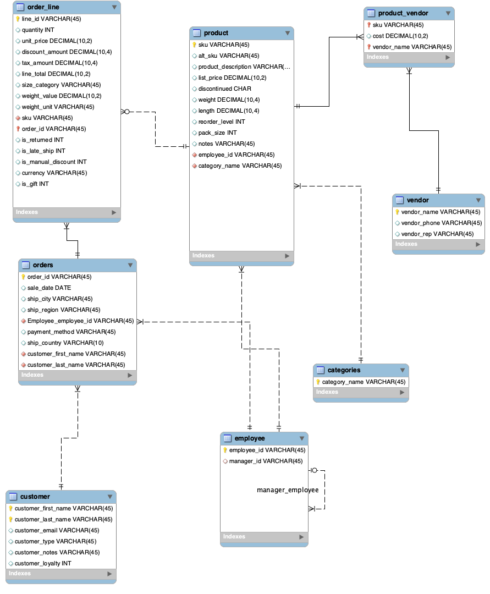

### **Northline Outfitters — Project 2**
Group B4 

## Table of Contents
1. [Team Members / Roles](#team-members--roles)
2. [Case Summary](#case-summary)
3. [Conceptual Model & Data Model](#conceptual-model--database-description)
4. [Database Description](#database-database-description)
5. [Data Quality Issues Identified](#issues-identified)
    - [Sales_Dump Issues](#sales_dump)
    - [Product_Supplier_Master Issues](#product_supplier_master)
6. [Highest Priority Data Issues](#highest-priority-quality-issues)
7. [Data Cleaning Process](#data-cleaning-process-product_supplier_master)
   - [SQL Code: Sales_Dump Cleaning](#sql-code-used-to-clean-sales_dump)
   - [SQL Code: Product_Supplier_Master Cleaning](#sql-codes-to-clean-the-product_supplier_master-table)
9. [Queries](#queries)

## **Team Members / Roles**

Zeynep Koseoglu (Database Designer & Data Wrangler & SQL Writer), Morgan Matherne (Conceptual Modeler & Group Leader & Data Wrangler), Hiya Shah (Data Wrangler), Roshan Gadiraju, Mark Monzer


## **Case Summary**

Northline Outfitters is a small online retail company that sells student-focused lifestyle and technology accessories, including items such as hoodies, water bottles, desk lamps, phone cases, keyboards, mouse pads, and backpacks. The company's data challenges are not just technical issues; they directly impact the company’s ability to operate and grow effectively. Because the Sales_Dump and Product_Supplier_Master datasets are messy, unstandardized, and inconsistent, the business struggles to generate reliable insights from its own data.

For example, inconsistent product names and duplicate entries make it difficult to accurately track inventory and sales performance, which can lead to overstocking or stockouts. Mixed date formats and unstructured transaction data limit the company’s ability to analyze trends over time, hurting forecasting and seasonal planning. Embedded currency values and inconsistent units (metric vs. imperial) introduce calculation errors, leading to inaccurate revenue reporting and flawed financial decisions.

The cleaned and structured database supports important business questions for Northline Outfitters, such as identifying top-selling products by country, evaluating employee performance in handling orders, and analyzing vendor-product relationships across categories. By converting the original spreadsheets into a relational model, the company gains a more reliable and scalable data foundation for decision-making, similar to what would be expected in a real-world business environment transitioning from spreadsheet-based operations to a database system.

## Database Description

Our database was designed to transform the two messy source spreadsheets, Sales_Dump and Product_Supplier_Master, into a compact relational model that supports data cleaning, structured storage, and the required SQL analysis. 

The model centers on the retail sales process for Northline Outfitters, a small online retailer that purchases products from outside vendors and sells them directly to customers in the United States and Canada. The database separates operational data into core business entities so that customer, employee, product, vendor, order, and payment information are not stored repeatedly in a single spreadsheet row. This reduces redundancy and makes the data easier to query and maintain. 

## **Conceptual Model**
## Data Model


## Data Model Description
The data model represents the operations of Northline, a retail company that sells student-friendly gear across the United States and Canada. The model is designed to track sales transactions, product inventory, customer demographics, employee performance, and vendor relationships across 8 interrelated entities.

## Entities and Relationships

customer stores information about Northline's customers, including their name, email, customer type (Regular, Student, or Guest), and loyalty status. Each customer can place many orders, establishing a one-to-many relationship between customer and orders.

orders captures each sales transaction, including the sale date, shipping destination, payment method, and the employee who processed the order. Each order is associated with one customer and one employee, but can contain multiple line items, creating a one-to-many relationship between orders and order_line.

order_line represents the individual line items within each order, recording the specific product purchased, quantity, unit price, discounts, taxes, line total, and fulfillment flags such as whether the item was returned, shipped late, or included a gift receipt. Each order_line links to one product and one order.

product contains the full catalog of products Northline carries, including descriptions, pricing, weight, dimensions, reorder levels, and discontinuation status. Each product belongs to one category and is managed by one employee. A product can appear in multiple order lines and can be supplied by multiple vendors.

categories is a simple lookup table that classifies products into groups such as Accessories, Tech, Audio, Lifestyle, Apparel, and School. One category can be associated with many products.

vendor stores information about Northline's suppliers, including vendor name, phone number, and sales representative. Each vendor can supply multiple products.

product_vendor serves as an associative entity resolving the many-to-many relationship between product and vendor. It records the cost at which each vendor supplies each product, allowing Northline to track which vendors carry which products and at what price.

employee represents Northline's staff members who process orders and manage products. The employee table has a self-referencing relationship called manager_employee, where each employee may report to a manager who is also stored in the same table. This recursive relationship allows the model to represent the organizational hierarchy without a separate manager table.


## Issues Identified
## `Sales_Dump`

| # | Column               | What's Wrong |
|---|----------------------|--------------|
| 1 | `line_id`            | No issues |
| 2 | `order_id`           | No issues |
| 3 | `sale_date`          | Dates are written 7+ different ways; one date is in the future; some dates are impossible to tell if they're MM/DD or DD/MM |
| 4 | `employee_ref`       | No issues |
| 5 | `manager_ref`        | No issues |
| 6 | `customer_info`      | Three different punctuation styles used to separate info; loyalty status, student status, and guest/member status are all crammed into one cell. Not normalized.|
| 7 | `customer_email`     | Lots of empty cells; some emails are broken (wrong ending); the same customer shows up with different email addresses |
| 8 | `payment_method`     | Same payment type written in different ways (e.g., `VISA`, `visa`, `Visa`); `MC` used sometimes instead of `Mastercard` |
| 9 | `sku`                | Some product codes are uppercase, some are lowercase — even for the same product |
| 10 | `product_description`| Same product name written in normal letters on some rows and ALL CAPS on others |
| 11 | `category`           | Same product put in different categories on different rows; no set list of allowed categories |
| 12 | `quantity`           | Some rows say `2`, others say `2 units` — it's not consistent |
| 13 | `unit_price`         | The currency (USD/CAD) is stuck inside the price cell instead of being its own column |
| 14 | `discount`           | Discounts written as `10%`, `10`, `promo5`, `student 10%`, or left blank — all meaning different things |
| 15 | `tax`                | Tax written as `0.07`, `7%`, or `HST 13%` with no consistency; lots of empty cells; unclear if it's a rate or a dollar amount |
| 16 | `line_total`         | Some totals have a `$` sign, some don't; lots of empty cells; some totals don't match the math |
| 17 | `ship_country`       | US written as both `US` and `USA`; Canada written as both `CA` and `Canada`; some rows left blank |
| 18 | `ship_to`            | Many rows just say `Same as billing` or `Dorm pickup` instead of a real address |
| 19 | `size_or_weight`     | Every possible unit is used (inches, ounces, grams, pounds, cm) with no standard; size and weight mixed in the same column; same product measured differently on different rows |
| 20 | `return_flag`        | Many cells are blank — it's unclear if blank means "No" or just "nobody filled this in" |
| 21 | `notes`              | No set list of allowed values; a new type of note (`student promo`) shows up halfway through with no explanation |


## `Product_Supplier_Master`

| #  | Column               | What's Wrong |
|----|----------------------|--------------|
| 1  | `sku`                | Some codes are uppercase, some lowercase; the same code appears on multiple rows for different versions of the same product |
| 2  | `alt_sku`            | Most cells are empty; some old codes are shared between two different rows |
| 3  | `product_description`| Product names for color/size variations are written differently every time (dashes, slashes, words — no pattern); some names are listed twice |
| 4  | `category`           | Three different separators used (`/`, `&`, `,`); one product is listed as `Accessories / Accessories`; one row uses a completely different style (`Student and apparels`) |
| 5  | `vendor_name`        | `Urban Source` is spelled `Urban Sources` (with an extra "s") on several rows — makes it look like two different vendors |
| 6  | `vendor_phone`       | The same vendor's phone number is written with dashes on some rows, dots on others, and parentheses on others |
| 7  | `vendor_rep`         | Missing email info is written inside the name cell (e.g., `Mia Diaz / email missing`) instead of being left blank; one name has a typo (`Mia Dia zFernandez`); one rep has `Ms.` in front of her name on some rows but not others |
| 8  | `cost`               | Some costs have a currency label (`USD 6.25`), others are just a bare number (`6.25`) — no consistency |
| 9  | `list_price`         | Same issue as cost — currency label sometimes there, sometimes not; same product has different prices on different rows with no explanation |
| 10 | `reorder_level`      | Some rows use the number `10`, others spell it out as `ten`; many rows are just blank |
| 11 | `pack_size`          | Many blank cells; the same concept is written many different ways (`Case of 6`, `3-pack`, `1 each`, `1`); same product has different pack sizes on different rows |
| 12 | `weight`             | Every unit of measurement is used (ounces, grams, pounds, kilograms) with no standard; two rows say `NA` instead of leaving the cell blank; same product has different weights on different rows |
| 13 | `length`             | Mix of inches and centimetres with no standard; one cell has just a number with no unit at all; same product has different lengths on different rows |
| 14 | `discontinued`       | Many blank cells — unclear if blank means "still active" or "nobody checked"; same product marked as discontinued on one row but active on another |
| 15 | `parent_sku`         | Most cells are blank even for rows that are clearly product variations; the few values that exist don't follow a consistent capitalization style |
| 16 | `notes`              | No set list of allowed values; some cells combine two notes with a semicolon instead of using separate columns; one note is written as a question (`duplicate desc?`); this appears to be an extra column that wasn't part of the original design |


## Highest Priority Quality issues 

1. **Dates are a mess (sale_date)**
Seven different formats, ambiguous day/month ordering, and a future date. You literally cannot sort or filter by date reliably until this is fixed. Everything time-based, trends, reports, order history, is broken.

2. **The same product has no single identity (sku)**
The same SKU appears in both uppercase and lowercase across both sheets, meaning a lookup from Sales_Dump to Product_Supplier_Master will silently fail for half the rows. You'd have missing products and no error to tell you why.

3. **Money can't be calculated (unit_price, cost, discount, tax, line_total)**
Currency is embedded in the price cell, discounts are written five different ways, tax is written three different ways, and hundreds of line_total cells are just blank. You cannot calculate revenue, profit margin, or anything financial without cleaning every single one of these columns first.

4. **The same product is described differently everywhere (product_description, category)**
All caps on some rows, title case on others, and the same product assigned different categories depending on the row. Any grouping or reporting by product or category will double-count or split things that should be together.

5. **The vendor name has a typo that splits one vendor into two (vendor_name)**
Urban Source vs. Urban Sources — this is small but dangerous. Any vendor-level report, spend summary, or contact list will show two entries for what is actually the same company, and neither will have the full picture.

6. **A "discontinued" product is one of the best sellers**
SKU-C-1014 (NoteNest Planner) is flagged as discontinued in Product_Supplier_Master but appears constantly throughout Sales_Dump. Either the product master is wrong, or sales are being recorded for a product that shouldn't exist anymore. Either way, something is seriously off between the two sheets.


## **Data Cleaning Process: Product_Supplier_Master**

The Product_Supplier_Master dataset contained multiple data quality issues, including inconsistent identifiers, mixed text and numeric formats, embedded currency labels, inconsistent units of measure, redundant helper columns, and unstructured notes. These issues were cleaned using SQL so the data could be standardized and loaded into the final relational model. The source spreadsheet included product, vendor, pricing, packaging, measurement, discontinuation, and parent SKU fields, so the cleaning process focused on making each of those attributes consistent and usable in the database.

**Our Process**
We imported the two sheets into MySQL and used the following queries to clean the data and address the issues identified above. We then pulled the cleaned data from the tables and split it into 8 sheets that correspond to our data model entities and the columns generated by forward-engineering our data model. Any columns we had difficulty cleaning in my SQL, we manually fixed in Excel. An example of this was the pack size; we changed all the different formatting presentations to just the number.

## SQL Code used to clean Sales_Dump 
```
1. UPDATE Sales_Dump
SET sale_date = CASE 
    WHEN sale_date LIKE '%-%' THEN STR_TO_DATE(sale_date, '%m-%d-%Y')
    WHEN sale_date LIKE '%Oct%' THEN '2025-10-17' -- Handled unique natural language cases
    ELSE sale_date 
END;
2. Customer Attribute Decomposition
Issue: The customer_info column contained three distinct data points—Name, Type, and Loyalty status—concatenated into a single string.
Solution: Employed SUBSTRING_INDEX and TRIM to split the string into atomic columns, following the principle of Database Normalization.

-- Extracting Name
UPDATE Sales_Dump SET customer_name = TRIM(SUBSTRING_INDEX(customer_info, ',', 1));

-- Extracting Loyalty Member Status (Boolean Conversion)
UPDATE Sales_Dump 
SET is_loyalty_member = CASE 
    WHEN customer_info LIKE '%Member%' THEN 1 
    ELSE 0 
END;

3. Geographic & Null Remediation
Issue: Missing data in shipping columns and placeholder text like "Same as billing" rendered regional reports inaccurate.
Solution: Used UPDATE statements to map billing data to shipping fields where necessary and parsed combined city/region strings.

UPDATE Sales_Dump 
SET ship_city = TRIM(SUBSTRING_INDEX(location_string, ',', 1)),
    ship_region = TRIM(SUBSTRING_INDEX(location_string, ',', -1))
WHERE location_string IS NOT NULL;
4. Financial & Numeric Conversion
Issue: Unit prices and totals included currency symbols ($, %) and were stored as text, which blocked mathematical operations like SUM() and AVG().
Solution: Stripped non-numeric symbols using REPLACE and cast the remaining strings to the DECIMAL data type.


5. UPDATE Sales_Dump 
SET unit_price = CAST(REPLACE(unit_price, '$', '') AS DECIMAL(10,2)),
    line_total = CAST(REPLACE(line_total, '$', '') AS DECIMAL(10,2));

6. Referential Consistency (Normalization)
Issue: Inconsistent casing (e.g., "visa" vs. "VISA" or "sku-1" vs. "SKU-1") would cause foreign key constraint violations.
Solution: Applied UPPER and TRIM to all primary and foreign key columns to ensure perfect matching during table joins.

7. UPDATE Sales_Dump 
SET sku = UPPER(TRIM(sku)),
    payment_method = UPPER(TRIM(payment_method));

8. Feature Engineering (Boolean Flags)
Issue: Operational insights (e.g., late shipments or gift orders) were buried in unstructured text within the notes column.
Solution: Created new Boolean columns and used the LIKE operator to extract specific flags for advanced business intelligence.

9. -- Identifying Late Shipments
UPDATE Sales_Dump 
SET is_late_ship = 1 
WHERE notes LIKE '%late%';

10. -- Flagging Manual Discounts for Audit
UPDATE Sales_Dump 
SET is_manual_discount = 1 
WHERE notes LIKE '%promo%' OR notes LIKE '%discount%';

11. Handling "Orphan" Records
Issue: Sales records with missing customer emails or non-existent SKUs would fail to import into a strict relational schema.
Solution: Identified these records and mapped them to a pre-defined "Unknown" placeholder in the parent tables to preserve transaction volume while maintaining integrity.

12. -- Redirecting missing links to a Guest placeholder
INSERT INTO Orders (customer_id, ...)
SELECT IFNULL(c.customer_id, 9999), ...
FROM Sales_Dump s
LEFT JOIN Customers c ON s.customer_email = c.email;
Summary: Through these programmatic updates, the dataset was transformed from a low-integrity "flat" format into a clean, normalized structure ready for complex SQL joins and multi-dimensional reporting.
```

## SQL codes to clean the Product_Supplier_Master table
```
-- SKU-related cleanup
UPDATE Product_Supplier_Master
SET sku = NULLIF(UPPER(TRIM(sku)), '');

UPDATE Product_Supplier_Master
SET alt_sku = NULLIF(UPPER(TRIM(alt_sku)), '');

UPDATE Product_Supplier_Master
SET parent_sku = NULLIF(UPPER(TRIM(parent_sku)), '');

-- Product description cleanup
UPDATE Product_Supplier_Master
SET product_description = NULLIF(TRIM(product_description), '');

-- Category standardization
UPDATE Product_Supplier_Master
SET category =
    CASE
        WHEN category LIKE '%Tech%' THEN 'Tech'
        WHEN category LIKE '%Accessories%' THEN 'Accessories'
        WHEN category LIKE '%Apparel%' THEN 'Apparel'
        WHEN category LIKE '%Audio%' THEN 'Audio'
        WHEN category LIKE '%Lifestyle%' THEN 'Lifestyle'
        WHEN category LIKE '%School%' THEN 'School'
        ELSE category
    END;

-- Vendor name cleanup
UPDATE Product_Supplier_Master
SET vendor_name = 'Urban Source'
WHERE vendor_name = 'Urban Sources';

-- Vendor phone cleanup
UPDATE Product_Supplier_Master
SET vendor_phone =
    REPLACE(
        REPLACE(
            REPLACE(
                REPLACE(
                    REPLACE(vendor_phone, '-', ''),
                '(', ''),
            ')', ''),
        ' ', ''),
    '.', '');

-- Vendor representative cleanup
UPDATE Product_Supplier_Master
SET vendor_rep = NULLIF(TRIM(vendor_rep), '');

UPDATE Product_Supplier_Master
SET vendor_rep = TRIM(SUBSTRING_INDEX(vendor_rep, '/', 1));

UPDATE Product_Supplier_Master
SET vendor_rep = 'Anika Roy'
WHERE vendor_rep = 'Ms. Anika Roy';

UPDATE Product_Supplier_Master
SET vendor_rep = 'Mia Diaz'
WHERE vendor_rep LIKE 'Mia Dia%';

-- Cost cleanup
UPDATE Product_Supplier_Master
SET cost = TRIM(
    REPLACE(
        REPLACE(cost, 'CAD ', ''),
        'USD ', ''
    )
);

UPDATE Product_Supplier_Master
SET cost = ROUND(CAST(cost AS DECIMAL(10,2)), 2);

-- List price cleanup
UPDATE Product_Supplier_Master
SET list_price = TRIM(
    REPLACE(
        REPLACE(list_price, 'CAD ', ''),
        'USD ', ''
    )
);

UPDATE Product_Supplier_Master
SET list_price = ROUND(CAST(list_price AS DECIMAL(10,2)), 2);

-- Reorder level cleanup
UPDATE Product_Supplier_Master
SET reorder_level = '10'
WHERE LOWER(TRIM(reorder_level)) LIKE '%ten%';

UPDATE Product_Supplier_Master
SET reorder_level = CAST(reorder_level AS UNSIGNED);

-- Pack size cleanup
UPDATE Product_Supplier_Master
SET pack_size =
    CASE
        WHEN pack_size IN ('1', '1 each') THEN '1 each'
        WHEN pack_size IN ('2/pack', '2-pack', '2 pack') THEN '2-pack'
        WHEN pack_size IN ('3-pack', '3 pack') THEN '3-pack'
        WHEN LOWER(pack_size) LIKE '%case of 6%' THEN 'Case of 6'
        ELSE pack_size
    END;

-- Weight cleanup and standardization to grams
UPDATE Product_Supplier_Master
SET weight = NULL
WHERE LOWER(TRIM(weight)) = 'na';

UPDATE Product_Supplier_Master
SET weight = REPLACE(weight, ' ', '');

UPDATE Product_Supplier_Master
SET weight =
    CASE
        WHEN weight LIKE '%g' AND weight NOT LIKE '%kg'
            THEN CAST(REPLACE(REPLACE(weight, 'grams', ''), 'g', '') AS DECIMAL(10,2))
        WHEN weight LIKE '%kg'
            THEN CAST(REPLACE(weight, 'kg', '') AS DECIMAL(10,2)) * 1000
        WHEN weight LIKE '%oz'
            THEN CAST(REPLACE(weight, 'oz', '') AS DECIMAL(10,2)) * 28.3495
        WHEN weight LIKE '%lb%'
            THEN CAST(REPLACE(REPLACE(weight, 'lb', ''), 'pound', '') AS DECIMAL(10,2)) * 453.592
        ELSE NULL
    END;

UPDATE Product_Supplier_Master
SET weight = ROUND(CAST(weight AS DECIMAL(10,2)), 2);

-- Length cleanup and standardization to centimeters
UPDATE Product_Supplier_Master
SET length = REPLACE(length, ' ', '');

UPDATE Product_Supplier_Master
SET length =
    CASE
        WHEN LOWER(length) LIKE '%cm'
            THEN CAST(REPLACE(LOWER(length), 'cm', '') AS DECIMAL(10,2))
        WHEN LOWER(length) LIKE '%in'
            THEN CAST(REPLACE(LOWER(length), 'in', '') AS DECIMAL(10,2)) * 2.54
        WHEN length LIKE '%"'
            THEN CAST(REPLACE(length, '"', '') AS DECIMAL(10,2)) * 2.54
        ELSE NULL
    END;

UPDATE Product_Supplier_Master
SET length = ROUND(CAST(length AS DECIMAL(10,2)), 2);

-- Discontinued cleanup
UPDATE Product_Supplier_Master
SET discontinued =
    CASE
        WHEN UPPER(TRIM(discontinued)) IN ('Y', 'YES', 'TRUE', '1') THEN 'Y'
        WHEN UPPER(TRIM(discontinued)) IN ('N', 'NO', 'FALSE', '0') THEN 'N'
        ELSE NULL
    END;

-- Notes cleanup
UPDATE Product_Supplier_Master
SET notes = NULLIF(TRIM(notes), '');

-- Redundant column removal
ALTER TABLE Product_Supplier_Master DROP COLUMN price_currency;
ALTER TABLE Product_Supplier_Master DROP COLUMN price_numeric;
ALTER TABLE Product_Supplier_Master DROP COLUMN weight_value;
ALTER TABLE Product_Supplier_Master DROP COLUMN weight_unit;
ALTER TABLE Product_Supplier_Master DROP COLUMN weight_kg;
ALTER TABLE Product_Supplier_Master DROP COLUMN length_value;
ALTER TABLE Product_Supplier_Master DROP COLUMN length_unit;
ALTER TABLE Product_Supplier_Master DROP COLUMN length_cm;

-- Parent SKU validation
SELECT DISTINCT p.parent_sku
FROM Product_Supplier_Master p
LEFT JOIN Product_Supplier_Master c
    ON p.parent_sku = c.sku
WHERE p.parent_sku IS NOT NULL
  AND c.sku IS NULL;
```


## **Queries**

**1. Top Products by Revenue and Country**
Natural Language Question: Which products generated the highest total sales revenue, by country?

```sql
SELECT 
    o.ship_country,
    p.product_description,
    p.sku,
    SUM(ol.line_total) AS total_revenue
FROM order_line ol
JOIN orders o  ON ol.order_id = o.order_id
JOIN product p ON ol.sku = p.sku
GROUP BY o.ship_country, p.sku, p.product_description
ORDER BY o.ship_country, total_revenue DESC;
```


**2. ‎Employee Performance vs. Managerial Peer Average**
Natural Language Question: Which employees handled the largest number of orders, and how do their results compare with other employees under the same manager?

```sql
SELECT 
    e.employee_id,
    e.manager_id,
    COUNT(o.order_id)                          AS orders_handled,
    ROUND(AVG(COUNT(o.order_id)) OVER (
        PARTITION BY e.manager_id
    ), 2)                                       AS manager_team_avg,
    COUNT(o.order_id) - ROUND(AVG(COUNT(o.order_id)) OVER (
        PARTITION BY e.manager_id
    ), 2)                                       AS vs_team_avg
FROM employee e
JOIN orders o ON e.employee_id = o.Employee_employee_id
GROUP BY e.employee_id, e.manager_id
ORDER BY e.manager_id, orders_handled DESC;
```


**3. Multi-Category Vendors**
Natural Language Question: Which vendors supply products that appear in more than one category?

```sql
SELECT 
    pv.vendor_name,
    COUNT(DISTINCT p.category_name)  AS num_categories,
    GROUP_CONCAT(DISTINCT p.category_name ORDER BY p.category_name) AS categories_supplied
FROM product_vendor pv
JOIN product p ON pv.sku = p.sku
GROUP BY pv.vendor_name
HAVING COUNT(DISTINCT p.category_name) > 1
ORDER BY num_categories DESC;
```


**4. Student Demographic Sales Impact**
Natural Language Question: What is the total revenue and average line total for orders associated with "Student" customers?
Business Justification: Since Northline focuses on student-friendly gear, this query quantifies the actual financial impact of the student demographic. If the average spend is lower than guests, management might implement "Student Bundle" deals to increase order value.

```sql
SELECT 
    c.customer_type,
    COUNT(ol.line_id)            AS total_orders,
    SUM(ol.line_total)           AS total_revenue,
    ROUND(AVG(ol.line_total), 2) AS avg_line_total,
    SUM(ol.quantity)             AS total_units_sold
FROM order_line ol
JOIN orders o   ON ol.order_id = o.order_id
JOIN customer c ON o.customer_first_name = c.customer_first_name
               AND o.customer_last_name = c.customer_last_name
GROUP BY c.customer_type
ORDER BY total_revenue DESC;
```


**5. High-Risk Inventory Audit (Returns vs. Sales)**
Natural Language Question: Which products have a return rate higher than 10% and what is the total revenue lost from those returns?
Business Justification: High return rates usually signal quality issues or misleading descriptions. By identifying these "High-Risk" items, the data wrangler can pinpoint specific vendors or products that are causing high processing costs and lost margins.

```sql
SELECT 
    p.sku,
    p.product_description,
    p.category_name,
    pv.vendor_name,
    COUNT(ol.line_id)                                    AS total_orders,
    SUM(ol.is_returned)                                  AS total_returns,
    ROUND(SUM(ol.is_returned) / COUNT(ol.line_id) * 100, 2) AS return_rate_pct,
    ROUND(SUM(CASE WHEN ol.is_returned = 1 
              THEN ol.line_total ELSE 0 END), 2)         AS revenue_lost
FROM order_line ol
JOIN product p        ON ol.sku = p.sku
JOIN product_vendor pv ON p.sku = pv.sku
GROUP BY p.sku, p.product_description, p.category_name, pv.vendor_name
HAVING ROUND(SUM(ol.is_returned) / COUNT(ol.line_id) * 100, 2) > 10
ORDER BY return_rate_pct DESC, revenue_lost DESC;
```


**6. Monthly Sales Growth by Category**
Natural Language Question: What is the average discount given per category in the United States versus Canada?
Business Justification: This identifies if one region is receiving significantly more discounts to move inventory. If Canadian orders have higher discounts, it may indicate a need to adjust base pricing in that country to maintain a healthy profit margin.

```sql
SELECT
    p.category_name,
    o.ship_country,
    COUNT(ol.line_id)                        AS total_orders,
    ROUND(AVG(ol.discount_amount) * 100, 2)  AS avg_discount_pct,
    ROUND(SUM(ol.line_total), 2)             AS total_revenue,
    ROUND(AVG(ol.line_total), 2)             AS avg_order_value
FROM order_line ol
JOIN orders o  ON ol.order_id = o.order_id
JOIN product p ON ol.sku = p.sku
WHERE o.ship_country IN ('US', 'CA')
GROUP BY p.category_name, o.ship_country
ORDER BY p.category_name, o.ship_country;
```


    
